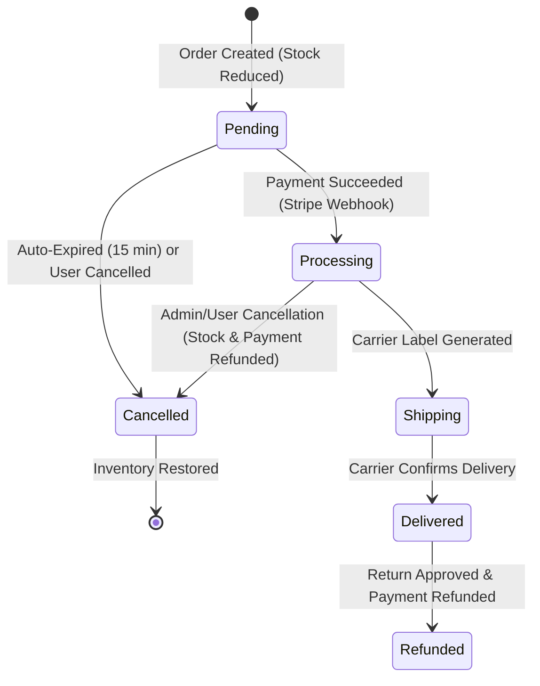

# Shopizy — Complete Feature Documentation

[⬅️ Back to README](../README.md) · [Repository Memory](RepositoryMemory.md) · [Technical Docs](TechnicalDocumentation.md) · [Frontend Handoff](FrontendHandoffDoc.md)

Welcome to the comprehensive feature guide for **Shopizy**, a modern, enterprise-grade e-commerce backend platform built on .NET 10 and Clean Architecture.

---

## 📑 Table of Contents

1. [Product Catalog & Merchandising](#1-product-catalog--merchandising)
2. [Faceted Search, Fuzzy Matching & Synonyms](#2-faceted-search-fuzzy-matching--synonyms)
3. [Shopping Cart & Abandoned Cart Recovery](#3-shopping-cart--abandoned-cart-recovery)
4. [Promotions & Discount Engine](#4-promotions--discount-engine)
5. [Order Management & Lifecycle Automation](#5-order-management--lifecycle-automation)
6. [Payment Processing & Stripe Webhooks](#6-payment-processing--stripe-webhooks)
7. [Shipping Carrier Rates & Live Tracking](#7-shipping-carrier-rates--live-tracking)
8. [Real-Time Operations & Admin Dashboards](#8-real-time-operations--admin-dashboards)
9. [Customer Reviews, Social Proof & Photos](#9-customer-reviews-social-proof--photos)
10. [Wishlists, Price-Drop & Restock Alerts](#10-wishlists-price-drop--restock-alerts)
11. [Loyalty Rewards & Gift Cards](#11-loyalty-rewards--gift-cards)
12. [Email Notifications](#12-email-notifications)
13. [Identity, RBAC & Security](#13-identity-rbac--security)

---

## 1. Product Catalog & Merchandising

Shopizy provides a rich catalog engine designed for high-scale retail operations.

### Key Capabilities
- **Hierarchical Categories:** Recursive multi-level category structures allowing nested catalog browsing.
- **Brand Management:** Dedicated brand aggregates with logos, descriptions, and filtering.
- **Rich Product Metadata:**
  - SKU, barcode, unit pricing with currency support (`USD`, `EUR`, `GBP`, etc.).
  - Variant dimensions (colors and sizes).
  - Comma-delimited search tags for catalog indexing.
  - Image galleries with sequence ordering and Cloudinary CDN integration.
- **Optimistic Concurrency:** Protects inventory and catalog records against simultaneous conflicting writes using concurrency tokens.
- **Bulk Operations:** Admin endpoints for bulk product activation, deactivation, and deletion.

---

## 2. Faceted Search, Fuzzy Matching & Synonyms

A dedicated in-memory and database-backed search engine powering intuitive product discovery.

### Key Capabilities
- **Multi-Token Text Scoring:** Evaluates exact token matches across title, tags, description, category, and brand.
- **Synonym Expansion:** Normalizes retail terminology (e.g. searching *"sneakers"* automatically matches *"Classic Running Shoes"*).
- **Levenshtein Typo Tolerance:** Fuzzy matching recovers from user misspellings (e.g. *"iphne"* matches *"Apple iPhone 15 Pro"*).
- **"Did You Mean?" Suggestions:** Automatically recommends corrected keywords when typos occur.
- **Dynamic Multi-Dimensional Facet Buckets:**
  - **Category Facets:** Grouped counts for matched categories.
  - **Brand Facets:** Grouped counts for matched brands.
  - **Price Range Buckets:** `<$25`, `$25–$50`, `$50–$100`, `$100–$200`, `$200+`.
  - **Rating Tiers:** `4★ & above`, `3★ & above`, `2★ & above`, `1★ & above`.
  - **Availability:** In-stock vs. out-of-stock live item counts.
- **Endpoint:** `POST /api/v1.0/products/faceted-search`

---

## 3. Shopping Cart & Abandoned Cart Recovery

High-throughput shopping cart management with automated customer re-engagement.

### Key Capabilities
- **Cart Line Items:** Supports variant options (color, size, quantity) and automatic pricing snapshots.
- **Inactivity Tracking:** Records cart modification timestamps (`LastAbandonedReminderSentOn`).
- **Automated Abandoned Cart Worker:**
  - Periodic background service (`AbandonedCartReminderWorker`) identifies carts inactive for $\ge 2$ hours.
  - Dispatches personalized recovery reminder emails with cart summary links.
  - Automatically resets reminder timestamps upon cart modifications to prevent duplicate spam.

---

## 4. Promotions & Discount Engine

An advanced promotional rules engine capable of complex pricing campaigns.

### Promo Types & Rules
- **Standard Percentage & Fixed Discounts:** Basic percentage or fixed amount discounts.
- **Buy-One-Get-One (BOGO):** Configurable *"Buy X, Get Y Free/Discounted"* with automatic discounted rate applied to the cheapest qualified units.
- **Tiered Minimum Spend:** Grants tiered savings once the subtotal satisfies qualifying minimum spend thresholds (`MinimumOrderAmount`).
- **Category-Specific Promotions:** Restricts coupon validity strictly to line items belonging to `TargetCategoryId`.
- **Safety Caps & Expirations:**
  - Maximum discount limits (`MaxDiscountAmount`).
  - Total usage count limits (`UsageLimit`).
  - Strict date validity windows (`StartDate` and `EndDate`).
- **Endpoint:** `POST /api/v1.0/promo-codes/validate`

---

## 5. Order Management & Lifecycle Automation

Full e-commerce order lifecycle management with automated inventory reservations.

### State Machine & Workflow

### Automation Highlights
- **Pending Order Auto-Expiration Worker:** Background worker (`PendingOrderExpirationWorker`) runs every minute to cancel unpaid orders older than 15 minutes, immediately restoring inventory.
- **Stock Restoration Guarantee:** Whenever an order transitions to `Cancelled` or `Refunded`, all line items automatically replenish inventory stock.

---

## 6. Payment Processing & Stripe Webhooks

Seamless payment gateway integration with Stripe and resilient webhook handling.

### Key Capabilities
- **Stripe Payment Intents:** Creates secure client-secret intents for checkout authorization.
- **Idempotent Webhook Processing:** `POST /api/v1.0/webhooks/stripe` handles event streams with signature verification:
  - `payment_intent.succeeded`: Marks order as `Processing`, triggers order confirmation emails, and dispatches real-time SignalR notifications.
  - `payment_intent.payment_failed`: Marks order as `Cancelled` and restores product inventory.
  - `charge.refunded`: Transitions order to `Refunded` status.
- **Automatic Refunds:** Automatic Stripe refund issuance when orders are cancelled after payment capture.

---

## 7. Shipping Carrier Rates & Live Tracking

Multi-carrier logistics integration providing live delivery rate estimates and tracking feeds.

### Key Capabilities
- **Multi-Carrier Rate Estimation:**
  - Compares **USPS**, **UPS**, **FedEx**, and **DHL** rates.
  - Evaluates package weight, destination country/zone, and delivery speed (Ground, 2-Day Express, Priority Overnight).
  - Automatic **Free Shipping Threshold** qualification (e.g. orders $\ge \$100$).
- **Live Package Tracking:**
  - Provides scan checkpoints (Origin Hub $\to$ Sorting Center $\to$ In Transit $\to$ Out for Delivery).
  - Calculates estimated delivery dates and current package location.
- **Endpoints:**
  - `POST /api/v1.0/shipping/estimate-rates`
  - `GET /api/v1.0/orders/{orderId}/tracking`

---

## 8. Real-Time Operations & Admin Dashboards

Two-way SignalR WebSockets providing live updates without polling.

### Key Capabilities
- **Customer Order Hub (`/hubs/orders`):**
  - Authenticated users automatically join private connection channels (`user-{userId}`).
  - Receives instant `ReceiveOrderStatusUpdate` events whenever order status changes.
- **Admin Metrics Hub (`/hubs/admin-dashboard`):**
  - Restricted to administrators with the `Admin` role.
  - Broadcasts live sales streams (`OrderCreated`, `OrderCancelled`, revenue totals) for real-time dashboards.

---

## 9. Customer Reviews, Social Proof & Photos

Comprehensive product review engine boosting customer conversion and trust.

### Key Capabilities
- **Verified Buyer Badges:** Automatically verifies whether the reviewing user completed a delivered purchase of the product before issuing the `IsVerifiedPurchase` badge.
- **Review Headlines & Photo Galleries:** Customers can submit concise headline summaries and photo attachments (`ImageUrls`).
- **Helpful Community Upvoting:** Readers can upvote helpful reviews (`POST /api/v1.0/products/{productId}/reviews/{reviewId}/helpful`).
- **Aggregated Ratings:** Real-time recalculation of average product star ratings and review distribution counts.

---

## 10. Wishlists, Price-Drop & Restock Alerts

Customer engagement tools monitoring price fluctuations and inventory availability.

### Key Capabilities
- **Wishlist Management:** Customers can save favorite products for later purchase.
- **Automated Price-Drop Alerts:** When a merchant updates product pricing to a lower amount, a `ProductPriceDroppedDomainEvent` alerts all customers holding the item in their wishlists.
- **Automated Back-in-Stock Alerts:** When inventory stock is replenished from zero, a `ProductBackInStockDomainEvent` notifies all interested wishlist subscribers.

---

## 11. Loyalty Rewards & Gift Cards

Retention and loyalty incentives driving repeat purchase behavior.

### Key Capabilities
- **Loyalty Points System:** Earn loyalty points on order completion and redeem points as cash discounts during checkout.
- **Digital Gift Cards:** Generate digital gift card vouchers with unique alphanumeric redemption codes and balance tracking.

---

## 12. Email Notifications

### Key Capabilities
- **Unified Dispatcher (`INotificationDispatcher`):** Routes notifications across transactional email templates and customer subscription preferences.
- **Email (`IEmailService`):** Rich HTML email dispatching (Order confirmation, password reset, welcome, order status updates, price drops, restocks).
- **Preference Controls:** Granular customer settings per user (order updates, promotions, price drops, restock alerts).

---

## 13. Identity, RBAC & Security

Enterprise security posture protecting user identities and API resources.

### Key Capabilities
- **JWT Authentication:** Short-lived access tokens with claim-based authorization policies.
- **Redis Refresh Tokens:** Secure sliding session tokens with automatic token rotation and revocation.
- **Role-Based Access Control (RBAC):** Granular permission definitions (`Admin`, `Customer`), cached name-to-id resolution (`IPermissionLookup`), and Admin endpoints to view user lists and update user roles and permissions (`PATCH /api/v1.0/admin/users/{userId}/role`).
- **Idempotency Store:** Redis-backed idempotency protection preventing duplicate charge submissions.
- **Security Headers & Rate Limiting:** Built-in protection against DDoS, brute force, clickjacking, and XSS attacks.
