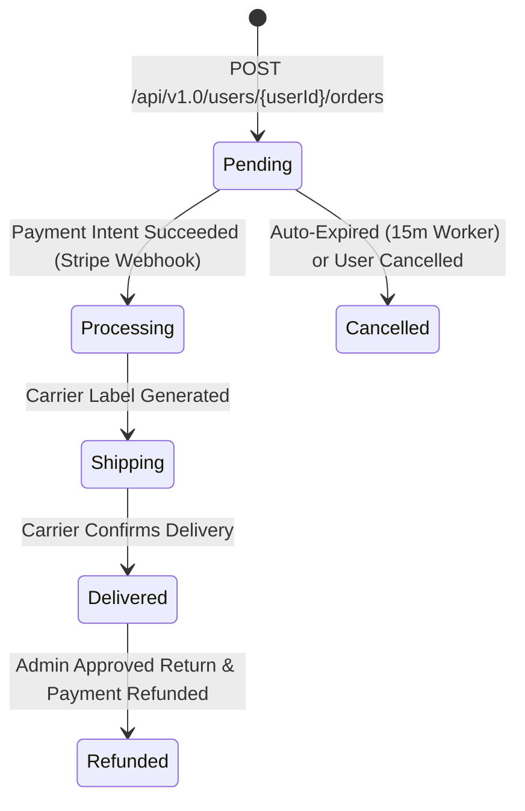

# 🚀 Shopizy — Frontend Handoff Document & AI Specification

> **Target Audience:** Frontend Engineering Team & AI Coding Assistants (e.g. Next.js, Vite, React, Vue, React Native)  
> **Backend Specification:** Shopizy API v1.0 (.NET 10 Clean Architecture & DDD)  
> **Base Endpoint:** `https://api.shopizy.com/api/v1.0` (or `http://localhost:5000/api/v1.0` in local dev)  
> **Document Date:** August 2026  

---

## 📑 Table of Contents

1. [Executive Summary & Architectural Overview](#1-executive-summary--architectural-overview)
2. [Authentication & Security Pipeline](#2-authentication--security-pipeline)
3. [Full TypeScript Interfaces & Data Schemas](#3-full-typescript-interfaces--data-schemas)
4. [Detailed API Endpoint Specifications](#4-detailed-api-endpoint-specifications)
   - [4.1 Faceted Search & Catalog Engine](#41-faceted-search--catalog-engine)
   - [4.2 Multi-Channel Notifications & Preferences](#42-multi-channel-notifications--preferences)
   - [4.3 Shopping Cart & Abandoned Cart Recovery](#43-shopping-cart--abandoned-cart-recovery)
   - [4.4 Shipping Carrier Rates & Live Order Tracking](#44-shipping-carrier-rates--live-order-tracking)
   - [4.5 Order Lifecycle & Stripe Checkout](#45-order-lifecycle--stripe-checkout)
   - [4.6 Promotions, BOGO, Loyalty & Gift Cards](#46-promotions-bogo-loyalty--gift-cards)
   - [4.7 Verified Reviews, Photos & Social Proof](#47-verified-reviews-photos--social-proof)
   - [4.8 Wishlist & Restock / Price-Drop Alerts](#48-wishlist--restock--price-drop-alerts)
5. [Real-Time SignalR WebSockets Integration](#5-real-time-signalr-websockets-integration)
6. [UI Component & Page Build Blueprint](#6-ui-component--page-build-blueprint)
7. [Error Handling & API Response Contracts](#7-error-handling--api-response-contracts)

---

## 1. Executive Summary & Architectural Overview

Shopizy is an enterprise-grade e-commerce platform built using Clean Architecture. This document provides everything required for an AI agent or frontend team to construct or adapt the user interface to align with all backend features, endpoints, and domain logic.

### Key Protocol Standards
- **REST Endpoints:** JSON over HTTPS, Version `v1.0`.
- **Authentication:** Bearer JWT tokens with sliding session Redis refresh tokens.
- **Idempotency:** HTTP Header `X-Idempotency-Key` required on critical state-modifying requests (`POST /orders`).
- **Real-Time Push:** SignalR WebSocket hubs (`/hubs/orders`, `/hubs/admin-dashboard`).
- **CDN Assets:** Cloudinary image URLs for high-resolution responsive rendering.

---

## 2. Authentication & Security Pipeline

All authenticated endpoints require an `Authorization` header containing a valid JWT access token:

```http
Authorization: Bearer <access_token>
```

### 2.1 Auth Endpoints

| Endpoint | Method | Auth Level | Description |
|---|---|---|---|
| `/api/v1.0/auth/login` | `POST` | Anonymous | Authenticates user credentials & returns tokens + user details. |
| `/api/v1.0/auth/register` | `POST` | Anonymous | Registers a new customer account. |
| `/api/v1.0/auth/refresh-token` | `POST` | Anonymous | Rotates expired access token using sliding Redis refresh token. |

### 2.2 Auth Interfaces

```typescript
export interface LoginRequest {
  email: string;
  password: string;
}

export interface RegisterRequest {
  firstName: string;
  lastName: string;
  email: string;
  password: string;
  phoneNumber?: string;
}

export interface AuthResponse {
  userId: string;
  email: string;
  firstName: string;
  lastName: string;
  roles: string[]; // e.g., ["Customer"], ["Admin"]
  token: string;
  refreshToken: string;
  tokenExpiresAtUtc: string;
}

export interface RefreshTokenRequest {
  token: string;
  refreshToken: string;
}
```

---

## 3. Full TypeScript Interfaces & Data Schemas

Include these core type definitions in your frontend application (`types/api.ts`):

```typescript
// --- Common & Pagination ---
export interface ApiErrorResponse {
  title: string;
  status: number;
  detail: string;
  errors?: Record<string, string[]>;
}

export interface Address {
  street: string;
  city: string;
  state: string;
  country: string;
  zipCode: string;
}

// --- Product & Faceted Search ---
export interface ProductSearchResultItem {
  id: string;
  name: string;
  description: string;
  price: number;
  currency: string;
  categoryId: string;
  categoryName?: string;
  brandId?: string;
  brandName?: string;
  stockQuantity: number;
  averageRating: number;
  totalReviews: number;
  imageUrls: string[];
  tags: string[];
}

export interface FacetValue {
  key: string;
  label: string;
  count: number;
}

export interface SearchFacet {
  fieldName: string;
  values: FacetValue[];
}

export interface ProductSearchResult {
  items: ProductSearchResultItem[];
  totalCount: number;
  pageNumber: number;
  pageSize: number;
  totalPages: number;
  facets: SearchFacet[];
  suggestedKeywords: string[];
}

export interface ProductVariant {
  id: string;
  sku: string;
  color?: string;
  size?: string;
  priceAdjustment: number;
  stockQuantity: number;
}

// --- Cart & Line Items ---
export interface CartItem {
  id: string;
  productId: string;
  productName: string;
  variantId?: string;
  variantDescription?: string;
  unitPrice: number;
  quantity: number;
  imageUrl?: string;
}

export interface Cart {
  id: string;
  userId: string;
  items: CartItem[];
  subtotal: number;
  totalItems: number;
  lastAbandonedReminderSentOn?: string;
}

// --- Shipping Rates & Tracking ---
export interface ShippingRateEstimate {
  carrierCode: string;   // e.g., "USPS", "UPS", "FedEx", "DHL"
  carrierName: string;
  serviceLevel: string;  // e.g., "Ground", "2-Day Express", "Priority Overnight"
  estimatedCost: number;
  estimatedDeliveryDays: number;
  isFreeShippingQualified: boolean;
}

export interface TrackingCheckpoint {
  timestampUtc: string;
  location: string;
  status: string;
  description: string;
}

export interface ShippingTrackingInfo {
  orderId: string;
  carrierName: string;
  trackingNumber: string;
  currentStatus: 'LabelCreated' | 'InTransit' | 'OutForDelivery' | 'Delivered' | 'Failed';
  estimatedDeliveryDateUtc?: string;
  checkpoints: TrackingCheckpoint[];
}

// --- Order Management ---
export type OrderStatus = 'Pending' | 'Processing' | 'Shipping' | 'Delivered' | 'Cancelled' | 'Refunded';

export interface OrderItem {
  id: string;
  productId: string;
  productName: string;
  variantId?: string;
  unitPrice: number;
  quantity: number;
  lineTotal: number;
}

export interface Order {
  id: string;
  userId: string;
  status: OrderStatus;
  shippingAddress: Address;
  items: OrderItem[];
  subtotal: number;
  discountAmount: number;
  shippingCost: number;
  taxAmount: number;
  totalAmount: number;
  promoCodeApplied?: string;
  stripePaymentIntentId?: string;
  clientSecret?: string; // Provided for Stripe Payment Element checkout
  createdAtUtc: string;
}

// --- Promotions, Loyalty & Gift Cards ---
export interface PromoCodeResponse {
  code: string;
  discountType: 'Percentage' | 'FixedAmount' | 'BuyXGetY' | 'TieredMinimumSpend';
  discountValue: number;
  maxDiscountAmount?: number;
  minimumOrderAmount?: number;
  targetCategoryId?: string;
  isValid: boolean;
}

export interface LoyaltyAccount {
  userId: string;
  pointsBalance: number;
  tierName: string; // e.g., "Silver", "Gold", "Platinum"
  cashEquivalentValue: number;
}

export interface GiftCard {
  code: string;
  initialBalance: number;
  remainingBalance: number;
  isRedeemed: boolean;
  expiresAtUtc?: string;
}

// --- Customer Reviews ---
export interface ProductReview {
  reviewId: string;
  userId: string;
  userName: string;
  rating: number; // 1 to 5
  headline?: string;
  comment: string;
  isVerifiedPurchase: boolean;
  helpfulVotesCount: number;
  imageUrls: string[];
  createdOn: string;
}

export interface CreateProductReviewRequest {
  rating: number;
  comment: string;
  headline?: string;
  imageUrls?: string[];
}

// --- Notification Preferences ---
export interface NotificationPreferences {
  userId: string;
  emailEnabled: boolean;
  smsEnabled: boolean;
  pushEnabled: boolean;
  orderUpdates: boolean;
  promotions: boolean;
  priceAlerts: boolean;
  restockAlerts: boolean;
}

export interface UpdateNotificationPreferencesRequest {
  emailEnabled: boolean;
  smsEnabled: boolean;
  pushEnabled: boolean;
  orderUpdates: boolean;
  promotions: boolean;
  priceAlerts: boolean;
  restockAlerts: boolean;
}
```

---

## 4. Detailed API Endpoint Specifications

### 4.1 Faceted Search & Catalog Engine

- **Endpoint:** `POST /api/v1.0/products/faceted-search`
- **Auth:** Anonymous (`AllowAnonymous`)
- **Purpose:** Full-text fuzzy search with automatic typo tolerance ("Did You Mean?") and dynamic aggregate breakdown facets.

#### Request Body
```json
{
  "searchTerm": "runing shos",
  "categoryIds": ["3fa85f64-5717-4562-b3fc-2c963f66afa6"],
  "brandIds": [],
  "minPrice": 20.0,
  "maxPrice": 150.0,
  "inStockOnly": true,
  "minRating": 4.0,
  "sortBy": "price_asc",
  "pageNumber": 1,
  "pageSize": 20
}
```

#### Response (`200 OK`)
```json
{
  "items": [
    {
      "id": "c71a39f1-729a-4c28-98e3-08dc99482b8a",
      "name": "Classic Running Shoes",
      "description": "Breathable high-performance athletic footwear.",
      "price": 89.99,
      "currency": "USD",
      "categoryId": "3fa85f64-5717-4562-b3fc-2c963f66afa6",
      "categoryName": "Footwear",
      "brandId": "b1111111-2222-3333-4444-555555555555",
      "brandName": "Nike",
      "stockQuantity": 42,
      "averageRating": 4.8,
      "totalReviews": 128,
      "imageUrls": ["https://res.cloudinary.com/demo/image/upload/v1/shoe.jpg"],
      "tags": ["running", "shoes", "sneakers", "athletic"]
    }
  ],
  "totalCount": 1,
  "pageNumber": 1,
  "pageSize": 20,
  "totalPages": 1,
  "facets": [
    {
      "fieldName": "Category",
      "values": [{ "key": "3fa85f64-5717-4562-b3fc-2c963f66afa6", "label": "Footwear", "count": 1 }]
    },
    {
      "fieldName": "Brand",
      "values": [{ "key": "b1111111-2222-3333-4444-555555555555", "label": "Nike", "count": 1 }]
    },
    {
      "fieldName": "PriceRange",
      "values": [{ "key": "50-100", "label": "$50–$100", "count": 1 }]
    }
  ],
  "suggestedKeywords": ["running shoes"]
}
```

---

### 4.2 Multi-Channel Notifications & Preferences

#### Send Transactional SMS (Admin Only)
- **Endpoint:** `POST /api/v1.0/notifications/sms`
- **Auth:** Required (`Admin` role)
- **Request Body:** `{ "phoneNumber": "+1234567890", "message": "Your order #1042 has shipped!" }`

#### Get / Update Notification Preferences
- **Endpoints:**
  - `GET /api/v1.0/users/{userId}/notification-preferences`
  - `PUT /api/v1.0/users/{userId}/notification-preferences`
- **Auth:** Required (Owner or `Admin`)
- **Request/Response Body:** `NotificationPreferences` DTO.

---

### 4.3 Shopping Cart & Abandoned Cart Recovery

| Method | Endpoint | Description |
|---|---|---|
| `GET` | `/api/v1.0/users/{userId}/cart` | Retrieves current cart lines & subtotal. |
| `POST` | `/api/v1.0/users/{userId}/cart/items` | Adds item or variant to cart. |
| `PUT` | `/api/v1.0/users/{userId}/cart/items/{itemId}` | Modifies item quantity. |
| `DELETE` | `/api/v1.0/users/{userId}/cart/items/{itemId}` | Removes line item. |

> **Abandoned Cart Worker Note:** The backend automatically identifies carts inactive for $\ge 2$ hours and dispatches email recovery reminders. Updating cart items resets the reminder timer.

---

### 4.4 Shipping Carrier Rates & Live Order Tracking

#### Estimate Shipping Rates
- **Endpoint:** `POST /api/v1.0/shipping/estimate-rates`
- **Auth:** Anonymous
- **Request Body:**
```json
{
  "street": "123 Main St",
  "city": "New York",
  "state": "NY",
  "country": "USA",
  "zipCode": "10001",
  "totalWeightKg": 1.5,
  "subtotal": 120.00
}
```
- **Response (`200 OK`):**
```json
[
  {
    "carrierCode": "USPS",
    "carrierName": "US Postal Service",
    "serviceLevel": "Ground Advantage",
    "estimatedCost": 0.0,
    "estimatedDeliveryDays": 3,
    "isFreeShippingQualified": true
  },
  {
    "carrierCode": "FedEx",
    "carrierName": "FedEx Express",
    "serviceLevel": "2-Day Express",
    "estimatedCost": 14.99,
    "estimatedDeliveryDays": 2,
    "isFreeShippingQualified": false
  }
]
```

#### Get Live Order Tracking
- **Endpoint:** `GET /api/v1.0/orders/{orderId}/tracking`
- **Auth:** Required (Order Owner or `Admin`)
- **Response (`200 OK`):** `ShippingTrackingInfo` object with checkpoint scan logs.

---

### 4.5 Order Lifecycle & Stripe Checkout



#### Order Submission Header Requirement
Send `X-Idempotency-Key: <unique-uuid>` with `POST /api/v1.0/users/{userId}/orders` to prevent double charges on connection drop.

---

### 4.6 Promotions, BOGO, Loyalty & Gift Cards

#### Validate Promo Code
- **Endpoint:** `POST /api/v1.0/users/{userId}/orders/validate-promo`
- **Auth:** Required
- **Body:** `"SUMMER2026"` (raw JSON string)
- **Response:** `PromoCodeResponse` object with rule details (percentage, fixed amount, or BOGO discount rate).

#### Loyalty Account & Points Redemption
- `GET /api/v1.0/users/{userId}/loyalty` — Get point balance & tier level.
- `POST /api/v1.0/users/{userId}/loyalty/redeem` — Redeem points for cash discount against cart subtotal.

---

### 4.7 Verified Reviews, Photos & Social Proof

- `GET /api/v1.0/products/{productId}/reviews` — List all reviews with aggregate rating breakdown.
- `POST /api/v1.0/products/{productId}/reviews` — Submit new review with optional Cloudinary `imageUrls`.
  > **Note:** Backend checks user purchase history automatically. If verified, sets `isVerifiedPurchase = true`.
- `POST /api/v1.0/products/{productId}/reviews/{reviewId}/helpful` — Increments helpful upvote counter.

---

### 4.8 Wishlist & Restock / Price-Drop Alerts

- `GET /api/v1.0/users/{userId}/wishlist`
- `POST /api/v1.0/users/{userId}/wishlist/items`
- `DELETE /api/v1.0/users/{userId}/wishlist/items/{productId}`

> **Automated Alerts:** Adding an item to the wishlist registers the user for automated Push & Email alerts whenever:
> 1. Product price is reduced (`ProductPriceDroppedDomainEvent`).
> 2. Out-of-stock product stock replenishes $\ge 1$ (`ProductBackInStockDomainEvent`).

---

## 5. Real-Time SignalR WebSockets Integration

The frontend must establish WebSocket connections using `@microsoft/signalr`.

### 5.1 Customer Order Updates Hub (`/hubs/orders`)

#### Connection Setup
```typescript
import * as signalR from '@microsoft/signalr';

const connection = new signalR.HubConnectionBuilder()
  .withUrl('https://api.shopizy.com/hubs/orders', {
    accessTokenFactory: () => jwtToken
  })
  .withAutomaticReconnect()
  .build();

// Listen for order status updates
connection.on('ReceiveOrderStatusUpdate', (data: { orderId: string; status: string; timestampUtc: string }) => {
  console.log(`Order ${data.orderId} updated to ${data.status}`);
  // Trigger UI Toast and refresh Order Details stepper
});

await connection.start();
```

### 5.2 Admin Real-Time Metrics Hub (`/hubs/admin-dashboard`)

#### Connection Setup (Admin Only)
```typescript
const adminHub = new signalR.HubConnectionBuilder()
  .withUrl('https://api.shopizy.com/hubs/admin-dashboard', {
    accessTokenFactory: () => adminJwtToken
  })
  .withAutomaticReconnect()
  .build();

adminHub.on('ReceiveMetricUpdate', (data: { metricType: string; data: any; timestampUtc: string }) => {
  // Update live sales metrics charts & counters
});

await adminHub.start();
```

---

## 6. UI Component & Page Build Blueprint

Follow this component hierarchy when building or updating the UI:

### Page 1: Dynamic Catalog & Search (`/search`)
- **`SearchBar` Component:** Includes autocomplete input + Typo Suggestion Banner (`"Did you mean: running shoes?"`).
- **`FacetSidebar` Component:** Multi-select checkboxes for Categories & Brands, price range slider, star rating filter, and "In-Stock Only" toggle.
- **`ProductGrid` Component:** Renders `ProductCard` items displaying badges (e.g. `BOGO`, `Free Shipping Qualified`), rating stars, price, and Quick Add to Cart button.

### Page 2: Product Detail Page (PDP) (`/products/[id]`)
- **`ImageGallery` Component:** Interactive main image + Cloudinary thumbnail carousel.
- **`VariantSelector` Component:** Color swatch pills and size buttons.
- **`PriceDropAlertButton` Component:** Toggles Wishlist state & confirms notification opt-in.
- **`ReviewsList` Component:** Displays `Verified Buyer` badge, photo gallery attachments, and `Was this helpful? (Upvote)` counter.

### Page 3: Smart Checkout (`/checkout`)
- **`AddressForm` Component:** Destination address input.
- **`ShippingCarrierRates` Component:** Displays live carrier estimates returned by `/shipping/estimate-rates`. Highlights `FREE` rate options automatically.
- **`PromotionsWidget` Component:** Promo Code input (validates percentage, fixed, BOGO), Loyalty Points redemption slider, and Digital Gift Card voucher input.
- **`StripePaymentElement` Component:** Mounts Stripe Elements using `clientSecret` from `/orders` endpoint response.

### Page 4: Order Tracking (`/account/orders/[id]`)
- **`OrderStatusStepper` Component:** Visual progress bar (`Pending` $\to$ `Processing` $\to$ `Shipped` $\to$ `Delivered`). Updates in real-time when SignalR event `ReceiveOrderStatusUpdate` fires!
- **`TrackingCheckpoints` Component:** Accordion list of carrier scan events with timestamp, location, and status.

### Page 5: Account & Notification Settings (`/account/preferences`)
- **`NotificationToggles` Component:** Form with switches for SMS, Push, and Email alerts categorized by Order Updates, Promotions, Price Drops, and Restock Alerts.

---

## 7. Error Handling & API Response Contracts

All errors returned by the API conform to ASP.NET Core `ProblemDetails` / `ErrorResult`:

```json
{
  "title": "Bad Request",
  "status": 400,
  "detail": "One or more validation errors occurred.",
  "errors": {
    "Code": ["The specified promo code has expired."],
    "StockQuantity": ["Insufficient stock available for requested quantity."]
  }
}
```

### Standard HTTP Status Codes

| Code | Meaning | Action Needed in UI |
|---|---|---|
| `200 OK` | Request succeeded | Process returned payload. |
| `201 Created` | Resource created | Redirect to resource page or show success banner. |
| `400 Bad Request` | Validation failure | Highlight corresponding form input errors. |
| `401 Unauthorized` | Missing/expired JWT | Trigger `POST /auth/refresh-token` or redirect to login. |
| `403 Forbidden` | Insufficient permissions | Display access denied notification. |
| `404 Not Found` | Entity missing | Render 404 Empty State component. |
| `409 Conflict` | Concurrency/State conflict | Prompt user to reload latest data. |
| `500 Server Error` | Unexpected backend error | Show generic "Something went wrong" toast with retry button. |

---
*End of Frontend Handoff Document.*
