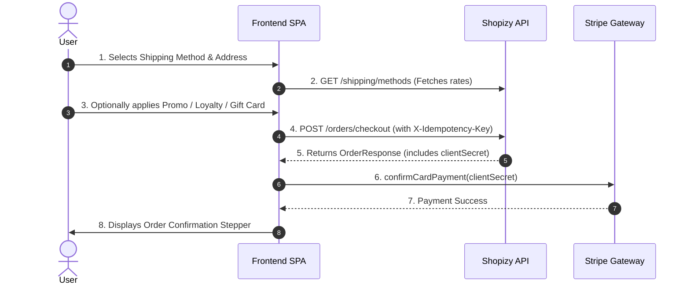

# 🚀 Shopizy — Frontend Handoff & AI Development Specification

> **Target Audience:** Frontend Engineering Teams & AI Coding Agents (Cursor, Copilot, Antigravity, Next.js, Angular, React, Vue)  
> **Backend Architecture:** .NET 10 Clean Architecture & DDD (REST JSON + SignalR WebSockets)  
> **Base API URL (Local Dev):** `http://localhost:5000/api/v1.0` (or `http://127.0.0.1:18080/api/v1.0`)  
> **Base API URL (Production):** `https://api.shopizy.com/api/v1.0`  
> **Last Updated:** August 2026  

---

## 📑 Table of Contents

1. [Architecture & Protocol Conventions](#1-architecture--protocol-conventions)
2. [Global TypeScript Interfaces & Schemas](#2-global-typescript-interfaces--schemas)
3. [Authentication & Account Management](#3-authentication--account-management)
4. [Catalog, Search & Faceted Filtering](#4-catalog-search--faceted-filtering)
5. [Shopping Cart Engine](#5-shopping-cart-engine)
6. [Shipping Methods & Fixed Tier Rates](#6-shipping-methods--fixed-tier-rates)
7. [Checkout & Order Placement Flow](#7-checkout--order-placement-flow)
8. [Payments & Stripe Integration](#8-payments--stripe-integration)
9. [Promotions, Loyalty & Gift Cards](#9-promotions-loyalty--gift-cards)
10. [Reviews, Questions & Social Proof](#10-reviews-questions--social-proof)
11. [Wishlist & Automatic Alerts](#11-wishlist--automatic-alerts)
12. [Real-Time SignalR Hubs](#12-real-time-signalr-hubs)
13. [Ready-to-Use TypeScript API Client Reference](#13-ready-to-use-typescript-api-client-reference)
14. [Standard Error Handling & ProblemDetails](#14-standard-error-handling--problemdetails)

---

## 1. Architecture & Protocol Conventions

* **Response Serialization:** JSON keys are returned in **`camelCase`**.
* **Identifiers:** Unique IDs are standard UUID/GUID formatted strings (e.g. `"3fa85f64-5717-4562-b3fc-2c963f66afa6"`).
* **Timestamps:** ISO 8601 UTC strings (e.g. `"2026-08-29T10:00:00Z"`).
* **Authentication:** Pass standard JWT in HTTP Header:
  ```http
  Authorization: Bearer <access_token>
  ```
* **Idempotency:** Pass `X-Idempotency-Key: <unique-uuid>` on critical mutation calls (such as checkout and payment submissions) to prevent duplicate processing.

---

## 2. Global TypeScript Interfaces & Schemas

Copy these core type definitions directly into your frontend project (e.g. `src/app/types/api.ts` or `@/types/api.ts`):

```typescript
// ==========================================
// 1. Common & Base Types
// ==========================================

export interface ApiErrorResponse {
  title: string;
  status: number;
  detail: string;
  errors?: Record<string, string[]>;
}

export interface Address {
  street: string;
  city: string;
  state: string;
  country: string;
  zipCode: string;
}

export interface Price {
  amount: number;
  currency: string;
}

// ==========================================
// 2. Authentication & User Profile
// ==========================================

export interface AuthResponse {
  id: string;
  firstName: string;
  lastName: string;
  email: string;
  role: 'Customer' | 'Admin' | string;
  token: string;
  refreshToken: string;
  refreshTokenExpiresAt: string;
}

export interface UserDetails {
  id: string;
  firstName: string;
  lastName: string;
  email: string;
  role: string;
  isTwoFactorEnabled: boolean;
  addresses: UserAddress[];
  defaultAddressId?: string;
  createdAtUtc: string;
}

export interface UserAddress extends Address {
  id: string;
  isDefault: boolean;
}

export interface NotificationPreferences {
  userId: string;
  emailEnabled: boolean;
  pushEnabled: boolean;
  orderUpdates: boolean;
  promotions: boolean;
  priceAlerts: boolean;
  restockAlerts: boolean;
}

// ==========================================
// 3. Products & Faceted Search
// ==========================================

export interface ProductItem {
  id: string;
  name: string;
  description: string;
  price: number;
  currency: string;
  categoryId: string;
  categoryName?: string;
  brandId?: string;
  brandName?: string;
  stockQuantity: number;
  averageRating: number;
  totalReviews: number;
  imageUrls: string[];
  tags: string[];
  highlights?: string[];
}

export interface FacetValue {
  key: string;
  label: string;
  count: number;
}

export interface SearchFacet {
  fieldName: string;
  values: FacetValue[];
}

export interface ProductSearchResult {
  items: ProductItem[];
  totalCount: number;
  pageNumber: number;
  pageSize: number;
  totalPages: number;
  facets: SearchFacet[];
  suggestedKeywords: string[];
}

// ==========================================
// 4. Shopping Cart
// ==========================================

export interface CartItem {
  id: string;
  productId: string;
  productName: string;
  color?: string;
  size?: string;
  unitPrice: number;
  quantity: number;
  imageUrl?: string;
}

export interface Cart {
  id: string;
  userId: string;
  items: CartItem[];
  subtotal: number;
  totalItems: number;
}

// ==========================================
// 5. Shipping & Tracking
// ==========================================

export interface ShippingMethod {
  carrier: string;            // e.g. "Standard", "Express", "Premium"
  serviceCode: 'STANDARD' | 'EXPRESS' | 'PREMIUM' | string;
  serviceName: string;        // e.g. "Standard Delivery", "Express Delivery", "Premium Delivery"
  rate: number;               // 4.99 | 9.99 | 19.99
  currency: string;           // "USD"
  estimatedDaysMin: number;
  estimatedDaysMax: number;
}

export enum DeliveryMethods {
  Standard = 1,
  Express = 2,
  Premium = 3
}

export interface TrackingCheckpoint {
  timestampUtc: string;
  location: string;
  description: string;
}

export interface ShippingTrackingInfo {
  carrier: string;
  trackingNumber: string;
  status: 'LabelCreated' | 'InTransit' | 'OutForDelivery' | 'Delivered' | 'Failed';
  currentLocation?: string;
  estimatedDelivery?: string;
  checkpoints: TrackingCheckpoint[];
}

// ==========================================
// 6. Orders & Checkout
// ==========================================

export type OrderStatus = 'Pending' | 'Processing' | 'Shipping' | 'Delivered' | 'Cancelled' | 'Refunded';

export interface OrderItemRequest {
  productId: string;
  color: string;
  size: string;
  quantity: number;
}

export interface CreateOrderRequest {
  promoCode?: string;
  giftCardCode?: string;
  deliveryMethod: DeliveryMethods | number; // 1 = Standard, 2 = Express, 3 = Premium
  deliveryCharge: Price;
  orderItems: OrderItemRequest[];
  shippingAddress: Address;
  loyaltyPointsToRedeem?: number;
}

export interface OrderItemResponse {
  id: string;
  productId: string;
  productName: string;
  color?: string;
  size?: string;
  quantity: number;
  unitPrice: number;
  lineTotal: number;
}

export interface OrderResponse {
  id: string;
  userId: string;
  status: OrderStatus;
  shippingAddress: Address;
  deliveryMethod: number;
  deliveryCharge: Price;
  orderItems: OrderItemResponse[];
  subtotal: number;
  discountAmount: number;
  totalAmount: number;
  loyaltyPointsUsed: number;
  loyaltyPointsEarned: number;
  giftCardAmountUsed: number;
  createdAtUtc: string;
  clientSecret?: string; // Stripe Payment Element clientSecret if payment required
}

// ==========================================
// 7. Promotions, Loyalty & Gift Cards
// ==========================================

export interface ValidatePromoResponse {
  code: string;
  discountType: 'Percentage' | 'FixedAmount' | 'BuyXGetY' | 'TieredMinimumSpend';
  discountValue: number;
  maxDiscountAmount?: number;
  minimumOrderAmount?: number;
  targetCategoryId?: string;
  isValid: boolean;
}

export interface LoyaltyAccountResponse {
  userId: string;
  pointsBalance: number;
  tierName: 'Bronze' | 'Silver' | 'Gold' | 'Platinum';
  cashEquivalentValue: number; // 100 points = $1.00
}

export interface GiftCardValidationResponse {
  code: string;
  balance: number;
  currency: string;
  isValid: boolean;
  expiresAtUtc?: string;
}
```

---

## 3. Authentication & Account Management

### 3.1 Endpoints Matrix

| Endpoint | Method | Auth Level | Purpose |
| :--- | :---: | :---: | :--- |
| `/api/v1.0/auth/register` | `POST` | Anonymous | Registers a new account |
| `/api/v1.0/auth/login` | `POST` | Anonymous | Logs in user & returns JWT access token + refresh token |
| `/api/v1.0/auth/refresh` | `POST` | Anonymous | Obtains a new JWT token using sliding refresh token |
| `/api/v1.0/auth/forgot-password` | `POST` | Anonymous | Sends password reset email link with `resetToken` |
| `/api/v1.0/auth/reset-password` | `POST` | Anonymous | Resets password using `resetToken` |
| `/api/v1.0/users/{userId}` | `GET` | Bearer | Gets user profile, default address, and 2FA status |
| `/api/v1.0/users/{userId}/notification-preferences` | `GET` | Bearer | Gets user notification preferences |
| `/api/v1.0/users/{userId}/notification-preferences` | `PUT` | Bearer | Updates user notification preferences (Email/Push) |

---

### 3.2 Key Request & Response Examples

#### 1. Register User (`POST /api/v1.0/auth/register`)
```json
// Request Body
{
  "firstName": "John",
  "lastName": "Doe",
  "email": "john.doe@example.com",
  "password": "SecurePassword123!"
}

// Response (200 OK) -> AuthResponse
```

#### 2. Reset Password (`POST /api/v1.0/auth/reset-password`)
> **Note for AI:** The token parameter is named `resetToken` (not `token`).
```json
// Request Body
{
  "resetToken": "CfDJ8N...%3D%3D",
  "newPassword": "NewSecurePassword123!"
}

// Response (200 OK)
{
  "message": "Password has been successfully reset."
}
```

#### 3. Update Notification Preferences (`PUT /api/v1.0/users/{userId}/notification-preferences`)
> **Note for AI:** SMS/Phone options are removed from the platform. Use `emailEnabled` and `pushEnabled`.
```json
// Request Body
{
  "emailEnabled": true,
  "pushEnabled": true,
  "orderUpdates": true,
  "promotions": false,
  "priceAlerts": true,
  "restockAlerts": true
}
```

---

## 4. Catalog, Search & Faceted Filtering

### Faceted Search (`POST /api/v1.0/products/faceted-search`)
* **Auth:** Anonymous
* **Features:** Full-text search with typo tolerance ("Did you mean?"), category/brand faceted counts, price ranges, and sorting.

```json
// Request Body
{
  "searchTerm": "running shoes",
  "categoryIds": ["3fa85f64-5717-4562-b3fc-2c963f66afa6"],
  "brandIds": [],
  "minPrice": 25.00,
  "maxPrice": 200.00,
  "inStockOnly": true,
  "minRating": 4.0,
  "sortBy": "price_asc",
  "pageNumber": 1,
  "pageSize": 20
}

// Response (200 OK) -> ProductSearchResult
```

---

## 5. Shopping Cart Engine

| Method | Endpoint | Description |
| :--- | :--- | :--- |
| `GET` | `/api/v1.0/users/{userId}/cart` | Retrieves cart items & subtotal |
| `PATCH` | `/api/v1.0/users/{userId}/cart/items` | Adds product item with color/size to cart |
| `PATCH` | `/api/v1.0/users/{userId}/cart/items/{cartItemId}` | Modifies item quantity |
| `DELETE` | `/api/v1.0/users/{userId}/cart/items/{cartItemId}` | Removes line item from cart |

```json
// Add to Cart Request Body (PATCH /api/v1.0/users/{userId}/cart/items)
{
  "productId": "3fa85f64-5717-4562-b3fc-2c963f66afa6",
  "color": "Black",
  "size": "US 10",
  "quantity": 1
}
```

---

## 6. Shipping Methods & Fixed Tier Rates

### Get Available Shipping Methods (`GET /api/v1.0/shipping/methods`)
* **Auth:** Anonymous
* **Parameters:** **None required (0 params, 0 body).**
* **Returns:** All 3 fixed delivery tiers with pricing and estimated delivery days.

```json
// Response (200 OK)
[
  {
    "carrier": "Standard",
    "serviceCode": "STANDARD",
    "serviceName": "Standard Delivery",
    "rate": 4.99,
    "currency": "USD",
    "estimatedDaysMin": 3,
    "estimatedDaysMax": 5
  },
  {
    "carrier": "Express",
    "serviceCode": "EXPRESS",
    "serviceName": "Express Delivery",
    "rate": 9.99,
    "currency": "USD",
    "estimatedDaysMin": 2,
    "estimatedDaysMax": 3
  },
  {
    "carrier": "Premium",
    "serviceCode": "PREMIUM",
    "serviceName": "Premium Delivery",
    "rate": 19.99,
    "currency": "USD",
    "estimatedDaysMin": 1,
    "estimatedDaysMax": 2
  }
]
```

### Live Order Tracking (`GET /api/v1.0/orders/{orderId}/tracking`)
* **Auth:** Bearer
* **Returns:** Real-time checkpoint scan history and current shipment status.

---

## 7. Checkout & Order Placement Flow

### Step-by-Step Checkout Architecture



### Checkout Endpoint (`POST /api/v1.0/orders/checkout`)
* **Auth:** Bearer
* **Headers:** `X-Idempotency-Key: <unique-guid>`

```json
// Request Body (CreateOrderRequest)
{
  "promoCode": "SUMMER10",
  "giftCardCode": "GC-2026-XYZ",
  "deliveryMethod": 1,
  "deliveryCharge": {
    "amount": 4.99,
    "currency": "USD"
  },
  "orderItems": [
    {
      "productId": "c71a39f1-729a-4c28-98e3-08dc99482b8a",
      "color": "Black",
      "size": "US 10",
      "quantity": 1
    }
  ],
  "shippingAddress": {
    "street": "123 Main Street",
    "city": "Austin",
    "state": "TX",
    "country": "USA",
    "zipCode": "78701"
  },
  "loyaltyPointsToRedeem": 100
}
```

---

## 8. Payments & Stripe Integration

1. When calling `POST /api/v1.0/orders/checkout`, if payment is required, the returned `OrderResponse` includes `clientSecret`.
2. Frontend mounts Stripe Elements and invokes:
   ```typescript
   const { paymentIntent, error } = await stripe.confirmCardPayment(orderResponse.clientSecret, {
     payment_method: {
       card: elements.getElement(CardElement)!,
       billing_details: { name: 'John Doe' }
     }
   });
   ```
3. Stripe Webhooks automatically transition the backend order state from `Pending` $\to$ `Processing`.

---

## 9. Promotions, Loyalty & Gift Cards

### 9.1 Validate Promo Code (`POST /api/v1.0/users/{userId}/orders/validate-promo`)
* **Request Body:** `"SUMMER2026"` (raw JSON string)
* **Response:** Returns discount calculations (percentage, fixed amount, or BOGO).

### 9.2 Loyalty Account (`GET /api/v1.0/users/{userId}/loyalty`)
* **Redemption Rule:** 100 points = **$1.00 cash discount**.
* **Automatic Earning:** Customers automatically earn 1 point for every $1 spent upon order completion.

### 9.3 Validate Gift Card (`POST /api/v1.0/gift-cards/validate`)
* **Request Body:** `{ "code": "GC-9999-ABCD" }`
* **Response:** `{ "balance": 50.00, "currency": "USD", "isValid": true }`

---

## 10. Reviews, Questions & Social Proof

* `GET /api/v1.0/products/{productId}/reviews` — Lists customer reviews + star breakdown.
* `POST /api/v1.0/products/{productId}/reviews` — Submit new review. Automatically marks `isVerifiedPurchase: true` if the user bought the item.
* `POST /api/v1.0/products/{productId}/reviews/{reviewId}/helpful` — Upvotes helpful review.
* `POST /api/v1.0/products/{productId}/questions` — Submit question about a product.

---

## 11. Wishlist & Automatic Alerts

* `GET /api/v1.0/users/{userId}/wishlist` — View saved items.
* `PATCH /api/v1.0/users/{userId}/wishlist` — Add item to wishlist.
* `DELETE /api/v1.0/users/{userId}/wishlist/items/{productId}` — Remove item.
* **Automatic Background Alerts:** When a user has a product in their wishlist, the backend automatically dispatches Email / Push notifications when:
  1. Price drops (`ProductPriceDroppedDomainEvent`).
  2. Out-of-stock item is restocked (`ProductBackInStockDomainEvent`).

---

## 12. Real-Time SignalR Hubs

Install `@microsoft/signalr`:
```bash
npm install @microsoft/signalr
```

### Order Status Real-Time Hub (`/hubs/orders`)

```typescript
import * as signalR from '@microsoft/signalr';

export class OrderTrackingHubService {
  private hubConnection: signalR.HubConnection;

  constructor() {
    this.hubConnection = new signalR.HubConnectionBuilder()
      .withUrl('http://localhost:5000/hubs/orders', {
        accessTokenFactory: () => localStorage.getItem('token') || ''
      })
      .withAutomaticReconnect()
      .build();
  }

  public startConnection(onStatusUpdated: (orderId: string, status: string) => void): void {
    this.hubConnection.on('ReceiveOrderStatusUpdate', (data: { orderId: string; status: string }) => {
      onStatusUpdated(data.orderId, data.status);
    });

    this.hubConnection
      .start()
      .catch((err) => console.error('Error establishing SignalR connection: ', err));
  }

  public stopConnection(): void {
    this.hubConnection.stop();
  }
}
```

---

## 13. Ready-to-Use TypeScript API Client Reference

Below is a complete, copy-pasteable Angular / TypeScript API client service for shipping:

```typescript
import { Injectable, inject } from '@angular/core';
import { HttpClient } from '@angular/common/http';
import { Observable } from 'rxjs';
import { ShippingMethod, ShippingTrackingInfo } from '../types/api';

@Injectable({
  providedIn: 'root',
})
export class ShippingApiService {
  private readonly http = inject(HttpClient);
  private readonly baseUrl = 'http://localhost:5000/api/v1.0';

  /**
   * Retrieves all fixed shipping delivery options (Standard, Express, Premium).
   * Requires 0 parameters.
   */
  getShippingMethods(): Observable<ShippingMethod[]> {
    return this.http.get<ShippingMethod[]>(`${this.baseUrl}/shipping/methods`);
  }

  /**
   * Retrieves real-time tracking checkpoints for a customer order.
   */
  getOrderTracking(orderId: string): Observable<ShippingTrackingInfo> {
    return this.http.get<ShippingTrackingInfo>(`${this.baseUrl}/orders/${orderId}/tracking`);
  }
}
```

---

## 14. Standard Error Handling & ProblemDetails

All errors follow RFC 7807 `ProblemDetails`:

```json
{
  "title": "Bad Request",
  "status": 400,
  "detail": "One or more validation errors occurred.",
  "errors": {
    "ResetToken": ["The specified password reset token is invalid or has expired."],
    "DeliveryMethod": ["Selected delivery method is invalid."]
  }
}
```

### HTTP Status Code Handling Matrix

| HTTP Status | Meaning | Recommended UI Action |
| :---: | :--- | :--- |
| **`200 OK` / `201 Created`** | Operation Succeeded | Update UI state / display success toast. |
| **`400 Bad Request`** | Validation Error | Render inline field errors from the `errors` dictionary. |
| **`401 Unauthorized`** | Token Missing or Expired | Trigger `/auth/refresh` or redirect user to `/login`. |
| **`403 Forbidden`** | Insufficient Role/Permission | Display "Access Denied" notification. |
| **`404 Not Found`** | Resource Missing | Render 404 empty state card. |
| **`409 Conflict`** | Concurrency or State Conflict | Prompt user to refresh latest data. |
| **`500 Server Error`** | Unhandled Error | Show "Something went wrong, please try again." toast. |

---
*End of Frontend Handoff Specification.*
